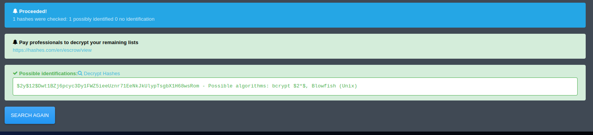
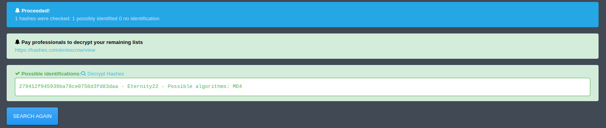
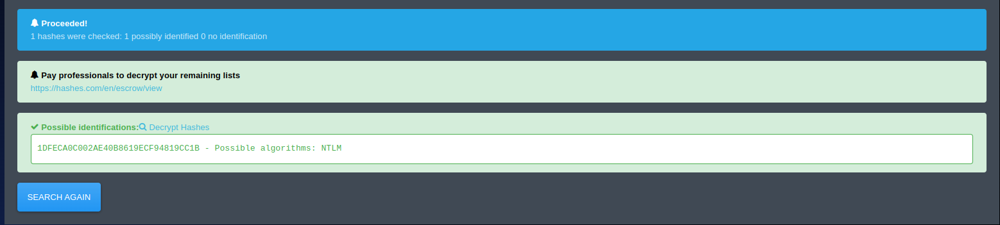
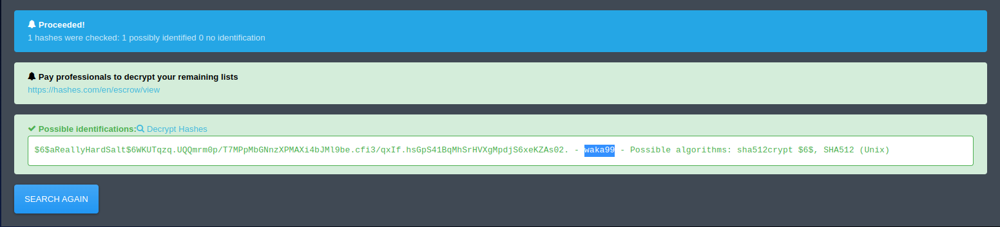
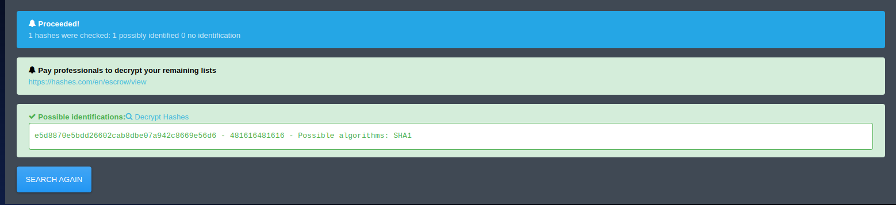

# Crack The Hash

Challenge Points: 270

Crack the hash is a tryhackme capture the flag (ctf) challenge in the cryptography category which focuses on the cracking of different hashing algorithms, this writeup will primarily make use of the tool **John The Ripper**.

## Level 1

This section contains challenges that online tools are capable of cracking

### Task 1

Hash: 48bb6e862e54f2a795ffc4e541caed4d

1. Store hash in a file for later use

```bash
[toluhunter@hunter crackthehash]$ echo 48bb6e862e54f2a795ffc4e541caed4d > ./Misc/task-1-level-1-hash.txt
```

3. Identify Hash being used

```bash
[toluhunter@hunter crackthehash]$ hash-identifier $(cat ./Misc/task-1-level-1-hash.txt)

   #########################################################################
   #     __  __                     __           ______    _____           #
   #    /\ \/\ \                   /\ \         /\__  _\  /\  _ `\         #
   #    \ \ \_\ \     __      ____ \ \ \___     \/_/\ \/  \ \ \/\ \        #
   #     \ \  _  \  /'__`\   / ,__\ \ \  _ `\      \ \ \   \ \ \ \ \       #
   #      \ \ \ \ \/\ \_\ \_/\__, `\ \ \ \ \ \      \_\ \__ \ \ \_\ \      #
   #       \ \_\ \_\ \___ \_\/\____/  \ \_\ \_\     /\_____\ \ \____/      #
   #        \/_/\/_/\/__/\/_/\/___/    \/_/\/_/     \/_____/  \/___/  v1.2 #
   #                                                             By Zion3R #
   #                                                    www.Blackploit.com #
   #                                                   Root@Blackploit.com #
   #########################################################################
--------------------------------------------------

Possible Hashs:
[+] MD5
[+] Domain Cached Credentials - MD4(MD4(($pass)).(strtolower($username)))

Least Possible Hashs:
[+] RAdmin v2.x
[+] NTLM
[+] MD4
<SNIP>
```

This shows under possible hashs section it is likely md5, use the tool hash-identifier or make use of this [website](https://hashes.com/en/tools/hash_identifier) to identify the hash

3. List hashes Suported by john the reaper, filter for identified hash

```bash
[toluhunter@hunter crackthehash]$ john --list=formats | grep -i md5
descrypt, bsdicrypt, md5crypt, md5crypt-long, bcrypt, scrypt, LM, AFS,
aix-ssha512, andOTP, ansible, argon2, as400-des, as400-ssha1, asa-md5,
dahua, dashlane, diskcryptor, Django, django-scrypt, dmd5, dmg, dominosec,
mschapv2-naive, krb5pa-md5, mssql, mssql05, mssql12, multibit, mysqlna,
mysql-sha1, mysql, net-ah, nethalflm, netlm, netlmv2, net-md5, netntlmv2,
netntlm, netntlm-naive, net-sha1, nk, notes, md5ns, nsec3, NT, o10glogon,
PBKDF2-HMAC-MD4, PBKDF2-HMAC-MD5, PBKDF2-HMAC-SHA1, PBKDF2-HMAC-SHA256,
PHPS2, pix-md5, PKZIP, po, postgres, PST, PuTTY, pwsafe, qnx, RACF,
Raw-Keccak, Raw-Keccak-256, Raw-MD4, "Raw-MD5", Raw-MD5u, Raw-SHA1,
Stribog-256, Stribog-512, STRIP, SunMD5, SybaseASE, Sybase-PROP, tacacs-plus,
tcp-md5, telegram, tezos, Tiger, tc_aes_xts, tc_ripemd160, tc_ripemd160boot,
ZipMonster, plaintext, has-160, HMAC-MD5, HMAC-SHA1, HMAC-SHA224,
oldoffice-opencl, PBKDF2-HMAC-MD4-opencl, PBKDF2-HMAC-MD5-opencl,
bitwarden-opencl, blockchain-opencl, cloudkeychain-opencl, md5crypt-opencl,
keychain-opencl, keyring-opencl, keystore-opencl, krb5pa-md5-opencl,
raw-MD4-opencl, raw-MD5-opencl, raw-SHA1-opencl, raw-SHA256-opencl,
```

4. Use the format RAW-MD5 of john the reaper and pass worldist and file containg the hash

```bash
[toluhunter@hunter crackthehash]$ john --format=RAW-MD5 --wordlist=~/Payloads/SecLists/Passwords/Leaked-Databases/rockyou.txt ./Misc/task-1-level-1-hash.txt | tee ./Result/task-1-level-1-john-ripper.txt
Using default input encoding: UTF-8
Loaded 1 password hash (Raw-MD5 [MD5 128/128 AVX 4x3])
Warning: no OpenMP support for this hash type, consider --fork=4
Press 'q' or Ctrl-C to abort, almost any other key for status
"easy"             (?) "<------------------ Here is the Password --------------"
1g 0:00:00:00 DONE (2023-05-11 22:18) 12.50g/s 2155Kp/s 2155Kc/s 2155KC/s erin18..dynamic1
Use the "--show --format=Raw-MD5" options to display all of the cracked passwords reliably
Session completed
```

> Password is **easy**

### Task 2

Hash: CBFDAC6008F9CAB4083784CBD1874F76618D2A97

1. Store has in a file for later

```bash
[toluhunter@hunter crackthehash]$ echo CBFDAC6008F9CAB4083784CBD1874F76618D2A97
 > ./Misc/task-2-level-1-hash.txt
```

2. Identify Hash

```bash
[toluhunter@hunter crackthehash]$ hash-identifier $(cat ./Misc/task-2-level-1-hash.txt)

   #########################################################################
   #     __  __                     __           ______    _____           #
   #    /\ \/\ \                   /\ \         /\__  _\  /\  _ `\         #
   #    \ \ \_\ \     __      ____ \ \ \___     \/_/\ \/  \ \ \/\ \        #
   #     \ \  _  \  /'__`\   / ,__\ \ \  _ `\      \ \ \   \ \ \ \ \       #
   #      \ \ \ \ \/\ \_\ \_/\__, `\ \ \ \ \ \      \_\ \__ \ \ \_\ \      #
   #       \ \_\ \_\ \___ \_\/\____/  \ \_\ \_\     /\_____\ \ \____/      #
   #        \/_/\/_/\/__/\/_/\/___/    \/_/\/_/     \/_____/  \/___/  v1.2 #
   #                                                             By Zion3R #
   #                                                    www.Blackploit.com #
   #                                                   Root@Blackploit.com #
   #########################################################################
--------------------------------------------------

[+] SHA-1
[+] MySQL5 - SHA-1(SHA-1($pass))

Least Possible Hashs:
[+] Tiger-160
[+] Haval-160
[+] RipeMD-160
[+] SHA-1(HMAC)
[+] Tiger-160(HMAC)
<SNIP>
```

3.  Use the format RAW-SHA1 of john the reaper and pass worldist and file containg the hash

```bash
[toluhunter@hunter crackthehash]$ john --format=RAW-SHA1 --wordlist=~/Payloads/SecLists/Passwords/Leaked-Databases/rockyou.txt ./Misc/task-2-level-1-hash.txt | tee ./Result/task-2-level-1-john-ripper.txt
Using default input encoding: UTF-8
Loaded 1 password hash (Raw-SHA1 [SHA1 128/128 AVX 4x])
Warning: no OpenMP support for this hash type, consider --fork=4
Press 'q' or Ctrl-C to abort, almost any other key for status
"password123"      (?) "<------------------ Here is the Password --------------"
1g 0:00:00:00 DONE (2023-05-11 22:25) 25.00g/s 34600p/s 34600c/s 34600C/s liberty..password123
Use the "--show --format=Raw-SHA1" options to display all of the cracked passwords reliably
Session completed
```

> Password is **password123**

### Task 3

Hash: 1C8BFE8F801D79745C4631D09FFF36C82AA37FC4CCE4FC946683D7B336B63032 

1. Store hash in a file for later use

```bash
[toluhunter@hunter crackthehash]$ echo 1C8BFE8F801D79745C4631D09FFF36C82AA37FC4CCE4FC946683D7B336B63032 > ./Misc[17/17$
-level-1-hash.txt
```

2.  Identify Hash

```bash
[toluhunter@hunter crackthehash]$ hash-identifier $(cat ./Misc/task-3-level-1-hash.txt) | tee ./Scans/task-3-level-1-ha
sh-identifier.txt
   #########################################################################
   #     __  __                     __           ______    _____           #
   #    /\ \/\ \                   /\ \         /\__  _\  /\  _ `\         #
   #    \ \ \_\ \     __      ____ \ \ \___     \/_/\ \/  \ \ \/\ \        #
   #     \ \  _  \  /'__`\   / ,__\ \ \  _ `\      \ \ \   \ \ \ \ \       #
   #      \ \ \ \ \/\ \_\ \_/\__, `\ \ \ \ \ \      \_\ \__ \ \ \_\ \      #
   #       \ \_\ \_\ \___ \_\/\____/  \ \_\ \_\     /\_____\ \ \____/      #
   #        \/_/\/_/\/__/\/_/\/___/    \/_/\/_/     \/_____/  \/___/  v1.2 #
   #                                                             By Zion3R #
   #                                                    www.Blackploit.com #
   #                                                   Root@Blackploit.com #
   #########################################################################
--------------------------------------------------

Possible Hashs:
[+] SHA-256
[+] Haval-256

Least Possible Hashs:
[+] GOST R 34.11-94
[+] RipeMD-256
[+] SNEFRU-256
[+] SHA-256(HMAC)
[+] Haval-256(HMAC)
[+] RipeMD-256(HMAC)
<SNIP>
```

3. Use the format RAW-SHA256 of john the reaper and pass worldist and file containg the hash

```bash
[toluhunter@hunter crackthehash]$ john --format=Raw-SHA256 --wordlist=~/Payloads/SecLists/Passwords/Leaked-Databases/ro
ckyou.txt ./Misc/task-3-level-1-hash.txt | tee ./Result/task-3-level-1-john-ripper.txt
Using default input encoding: UTF-8
Loaded 1 password hash (Raw-SHA256 [SHA256 128/128 AVX 4x])
Warning: poor OpenMP scalability for this hash type, consider --fork=4
Will run 4 OpenMP threads
Press 'q' or Ctrl-C to abort, almost any other key for status
"letmein"          (?) "<------------------ Here is the Password --------------"
1g 0:00:00:00 DONE (2023-05-11 23:52) 20.00g/s 655360p/s 655360c/s 655360C/s 123456..dyesebel
Use the "--show --format=Raw-SHA256" options to display all of the cracked passwords reliably
Session completed
```

> Password is **letmein**

### Task 4

Hash: $2y$12$Dwt1BZj6pcyc3Dy1FWZ5ieeUznr71EeNkJkUlypTsgbX1H68wsRom

1. Store hash for later use

```bash
[toluhunter@hunter crackthehash]$ echo '$2y$12$Dwt1BZj6pcyc3Dy1FWZ5ieeUznr71EeNkJkUlypTsgbX1H68wsRom' > ./Misc/task-4-level-1-hash.txt
```

2. Identify Hash

```bash
[toluhunter@hunter crackthehash]$ hash-identifier $(cat ./Misc/task-4-level-1-hash.txt) | tee ./Scans/task-4-level-1-ha
sh-identifier.txt
   #########################################################################
   #     __  __                     __           ______    _____           #
   #    /\ \/\ \                   /\ \         /\__  _\  /\  _ `\         #
   #    \ \ \_\ \     __      ____ \ \ \___     \/_/\ \/  \ \ \/\ \        #
   #     \ \  _  \  /'__`\   / ,__\ \ \  _ `\      \ \ \   \ \ \ \ \       #
   #      \ \ \ \ \/\ \_\ \_/\__, `\ \ \ \ \ \      \_\ \__ \ \ \_\ \      #
   #       \ \_\ \_\ \___ \_\/\____/  \ \_\ \_\     /\_____\ \ \____/      #
   #        \/_/\/_/\/__/\/_/\/___/    \/_/\/_/     \/_____/  \/___/  v1.2 #
   #                                                             By Zion3R #
   #                                                    www.Blackploit.com #
   #                                                   Root@Blackploit.com #
   #########################################################################
--------------------------------------------------

 Not Found.
--------------------------------------------------
```

Hash-identifier was unable to identify hash hence made use of website mentioned previously



Scan Identifies hash as `bcrypt 2$*$, blowfish*`

3. Performing a crack with the use of john the reaper and the rockyou.txt proved slow clicking the hint on the challenge says `Search the hashcat examples page (https://hashcat.net/wiki/doku.php?id=example_hashes) for $2y$. This type of hash can take a very long time to crack, so either filter rockyou for four character words, or use a mask for four lower case alphabetical characters.`
   
   Following the later instruction filter rockyou.txt to only contain lowercase passwords of exact length of 4 characters

```bash
[toluhunter@hunter crackthehash]$ grep -P '^[a-z]{4}$' ~/Payloads/SecLists/Passwords/Leaked-Databases/rockyou.txt > ~/Payloads/SecLists/Passwords/Leaked-Databases/rockyou-len-4.txt
```

4.  make use of john the reaper with newly filtered wordlist

```bash
[toluhunter@hunter crackthehash]$ john --format=bcrypt --wordlist=~/Payloads/SecLists/Passwords/Leaked-Databases/rockyou-len-4.txt ./Misc/task-4-level-1-hash.txt
Using default input encoding: UTF-8
Loaded 1 password hash (bcrypt [Blowfish 32/64 X3])
Cost 1 (iteration count) is 4096 for all loaded hashes
Will run 4 OpenMP threads
Press 'q' or Ctrl-C to abort, almost any other key for status
"bleh"             (?) "<------------------ Here is the Password --------------"
1g 0:00:00:32 DONE (2023-05-12 13:27) 0.03049g/s 15.37p/s 15.37c/s 15.37C/s paco..mets
Use the "--show" option to display all of the cracked passwords reliably
Session completed
```

> Password is **bleh**

### Task 5

Hash:   279412f945939ba78ce0758d3fd83daa

1. Store Hash in file for later use

```bash
[toluhunter@hunter crackthehash]$ echo 279412f945939ba78ce0758d3fd83daa > ./Misc/task-5-level-1-hash.txt
```

2. Identify hash

```bash
[toluhunter@hunter crackthehash]$ hash-identifier $(cat ./Misc/task-5-level-1-hash.txt) | tee ./Scans/task-5-level-1-hash-identifier.txt
   #########################################################################
   #     __  __                     __           ______    _____           #
   #    /\ \/\ \                   /\ \         /\__  _\  /\  _ `\         #
   #    \ \ \_\ \     __      ____ \ \ \___     \/_/\ \/  \ \ \/\ \        #
   #     \ \  _  \  /'__`\   / ,__\ \ \  _ `\      \ \ \   \ \ \ \ \       #
   #      \ \ \ \ \/\ \_\ \_/\__, `\ \ \ \ \ \      \_\ \__ \ \ \_\ \      #
   #       \ \_\ \_\ \___ \_\/\____/  \ \_\ \_\     /\_____\ \ \____/      #
   #        \/_/\/_/\/__/\/_/\/___/    \/_/\/_/     \/_____/  \/___/  v1.2 #
   #                                                             By Zion3R #
   #                                                    www.Blackploit.com #
   #                                                   Root@Blackploit.com #
   #########################################################################
--------------------------------------------------

Possible Hashs:
[+] MD5
[+] Domain Cached Credentials - MD4(MD4(($pass)).(strtolower($username)))

Least Possible Hashs:
[+] RAdmin v2.x
[+] NTLM
[+] MD4
[+] MD2
<SNIP>
```

3. make use of Raw-MD5 format and john to crack the hash

```bash
[toluhunter@hunter crackthehash]$ john --format=RAW-MD5 --wordlist=~/Payloads/SecLists/Passwords/Leaked-Databases/rockyou.txt ./Misc/task-5-level-1-hash.txt
Using default input encoding: UTF-8
Loaded 1 password hash (Raw-MD5 [MD5 128/128 AVX 4x3])
Warning: no OpenMP support for this hash type, consider --fork=4
Press 'q' or Ctrl-C to abort, almost any other key for status
0g 0:00:00:01 DONE (2023-05-12 15:05) 0g/s 10393Kp/s 10393Kc/s 10393KC/s  filimani..*7¡Vamos!
Session completed
```

4. No password was found when cracking, check website to confirm hash type as well as view if hash has been cracked



Password Shows as `Eternity22` hash algorithm was MD4

> Password is **Eternity22**


## Level 2

Level 2 of the ctf displays the information 
```text
This task increases the difficulty. All of the answers will be in the classic [rock you](https://github.com/brannondorsey/naive-hashcat/releases/download/data/rockyou.txt) password list.

You might have to start using hashcat here and not online tools. It might also be handy to look at some example hashes on [hashcats page](https://hashcat.net/wiki/doku.php?id=example_hashes).
```

This write up will continue with john the ripper


### Task 1

Hash: F09EDCB1FCEFC6DFB23DC3505A882655FF77375ED8AA2D1C13F640FCCC2D0C85

1. Save hash to a file

```bash
[toluhunter@hunter crackthehash]$ echo F09EDCB1FCEFC6DFB23DC3505A882655FF77375ED8AA2D1C13F640FCCC2D0C85 > ./Misc/task-1-level-2-hash.txt
```

2. Identify hash

```bash
[toluhunter@hunter crackthehash]$ hash-identifier $(cat ./Misc/task-1-level-2-hash.txt) | tee ./Scans/task-1-level-2-hash-identifier.txt
   #########################################################################
   #     __  __                     __           ______    _____           #
   #    /\ \/\ \                   /\ \         /\__  _\  /\  _ `\         #
   #    \ \ \_\ \     __      ____ \ \ \___     \/_/\ \/  \ \ \/\ \        #
   #     \ \  _  \  /'__`\   / ,__\ \ \  _ `\      \ \ \   \ \ \ \ \       #
   #      \ \ \ \ \/\ \_\ \_/\__, `\ \ \ \ \ \      \_\ \__ \ \ \_\ \      #
   #       \ \_\ \_\ \___ \_\/\____/  \ \_\ \_\     /\_____\ \ \____/      #
   #        \/_/\/_/\/__/\/_/\/___/    \/_/\/_/     \/_____/  \/___/  v1.2 #
   #                                                             By Zion3R #
   #                                                    www.Blackploit.com #
   #                                                   Root@Blackploit.com #
   #########################################################################
--------------------------------------------------

Possible Hashs:
[+] SHA-256
[+] Haval-256

Least Possible Hashs:
[+] GOST R 34.11-94
[+] RipeMD-256
<SNIP>
```

3. Use format Raw-SHA256 with john the ripper to crack the hash

```bash
[toluhunter@hunter crackthehash]$ john --format=RAW-SHA256 --wordlist=~/Payloads/SecLists/Passwords/Leaked-Databases/rockyou.txt ./Misc/task-1-level-2-hash.txt
Using default input encoding: UTF-8
Loaded 1 password hash (Raw-SHA256 [SHA256 128/128 AVX 4x])
Warning: poor OpenMP scalability for this hash type, consider --fork=4
Will run 4 OpenMP threads
Press 'q' or Ctrl-C to abort, almost any other key for status
"paule"            (?) "<------------------ Here is the Password --------------"
1g 0:00:00:00 DONE (2023-05-12 15:30) 14.28g/s 1404Kp/s 1404Kc/s 1404KC/s rozalia..Dominic1
Use the "--show --format=Raw-SHA256" options to display all of the cracked passwords reliably
Session completed
```

> Password is **paule**

### Task 2

Hash: 1DFECA0C002AE40B8619ECF94819CC1B

1. Save hash to a file

```bash
[toluhunter@hunter crackthehash]$ echo 1DFECA0C002AE40B8619ECF94819CC1B > ./Misc/task-2-level-2-hash.txt
```

2. Identify hash

```bash
[toluhunter@hunter crackthehash]$ hash-identifier $(cat ./Misc/task-2-level-2-hash.txt) | tee ./Scans/task-2-level-2-hash-identifier.txt
   #########################################################################
   #     __  __                     __           ______    _____           #
   #    /\ \/\ \                   /\ \         /\__  _\  /\  _ `\         #
   #    \ \ \_\ \     __      ____ \ \ \___     \/_/\ \/  \ \ \/\ \        #
   #     \ \  _  \  /'__`\   / ,__\ \ \  _ `\      \ \ \   \ \ \ \ \       #
   #      \ \ \ \ \/\ \_\ \_/\__, `\ \ \ \ \ \      \_\ \__ \ \ \_\ \      #
   #       \ \_\ \_\ \___ \_\/\____/  \ \_\ \_\     /\_____\ \ \____/      #
   #        \/_/\/_/\/__/\/_/\/___/    \/_/\/_/     \/_____/  \/___/  v1.2 #
   #                                                             By Zion3R #
   #                                                    www.Blackploit.com #
   #                                                   Root@Blackploit.com #
   #########################################################################
--------------------------------------------------

Possible Hashs:
[+] MD5
[+] Domain Cached Credentials - MD4(MD4(($pass)).(strtolower($username)))

Least Possible Hashs:
[+] RAdmin v2.x
[+] NTLM
[+] MD4
[+] MD2
<SNIP>
```

3. Crack hash with format RAW-MD5 using john the ripper

```bash
[toluhunter@hunter crackthehash]$ john --format=RAW-MD5 --wordlist=~/Payloads/SecLists/Passwords/Leaked-Databases/rockyou.txt ./Misc/task-2-level-2-hash.txt | tee ./Result/task-2-level-2-john-ripper.txt
Using default input encoding: UTF-8
Loaded 1 password hash (Raw-MD5 [MD5 128/128 AVX 4x3])
Warning: no OpenMP support for this hash type, consider --fork=4
Press 'q' or Ctrl-C to abort, almost any other key for status
0g 0:00:00:01 DONE (2023-05-12 15:37) 0g/s 11756Kp/s 11756Kc/s 11756KC/s  filimani..*7¡Vamos!
Session completed
```

no hash was found, trying method used in level 1 task 5



no password was found however suggested algorithm is NTLM

4. Crack hash with format NT using john the ripper

```bash
[toluhunter@hunter crackthehash]$ john --format=NT --wordlist=~/Payloads/SecLists/Passwords/Leaked-Databases/rockyou.txt ./Misc/task-2-level-2-hash.txt | tee ./Result/task-2-level-2-john-ripper.txt
Using default input encoding: UTF-8
Loaded 1 password hash (NT [MD4 128/128 AVX 4x3])
Warning: no OpenMP support for this hash type, consider --fork=4
Press 'q' or Ctrl-C to abort, almost any other key for status
"n63umy8lkf4i"     (?) "<------------------ Here is the Password --------------"
1g 0:00:00:00 DONE (2023-05-12 15:53) 1.960g/s 10272Kp/s 10272Kc/s 10272KC/s n65452..n6268600
Use the "--show --format=NT" options to display all of the cracked passwords reliably
Session completed
```

> Password is **n63umy8lkf4i**


### Task 3

  
Hash: `$6$aReallyHardSalt$6WKUTqzq.UQQmrm0p/T7MPpMbGNnzXPMAXi4bJMl9be.cfi3/qxIf.hsGpS41BqMhSrHVXgMpdjS6xeKZAs02.`

1. Save hash to a file

```bash
[toluhunter@hunter crackthehash]$ echo '$6$aReallyHardSalt$6WKUTqzq.UQQmrm0p/T7MPpMbGNnzXPMAXi4bJMl9be.cfi3/qxIf.hsGpS41BqMhSrHVXgMpdjS6xeKZAs02.' > ./Misc/task-3-level-2-hash.txt
```

2. Identify Hash

```
[toluhunter@hunter crackthehash]$ hash-identifier $(cat ./Misc/task-3-level-2-hash.txt) | tee ./Scans/task-3-level-2-hash-identifier.txt
   #########################################################################
   #     __  __                     __           ______    _____           #
   #    /\ \/\ \                   /\ \         /\__  _\  /\  _ `\         #
   #    \ \ \_\ \     __      ____ \ \ \___     \/_/\ \/  \ \ \/\ \        #
   #     \ \  _  \  /'__`\   / ,__\ \ \  _ `\      \ \ \   \ \ \ \ \       #
   #      \ \ \ \ \/\ \_\ \_/\__, `\ \ \ \ \ \      \_\ \__ \ \ \_\ \      #
   #       \ \_\ \_\ \___ \_\/\____/  \ \_\ \_\     /\_____\ \ \____/      #
   #        \/_/\/_/\/__/\/_/\/___/    \/_/\/_/     \/_____/  \/___/  v1.2 #
   #                                                             By Zion3R #
   #                                                    www.Blackploit.com #
   #                                                   Root@Blackploit.com #
   #########################################################################
--------------------------------------------------

 Not Found.
--------------------------------------------------
```

hash-identifier was unable to identify the hash over to previously mentioned website 



3. Optional john the ripper crash 

```bash
[toluhunter@hunter crackthehash]$ john --format=sha512crypt --wordlist=~/Payloads/SecLists/Passwords/Leaked-Databases/rockyou.txt ./Misc/task-3-level-2-hash.txt
Using default input encoding: UTF-8
Loaded 1 password hash (sha512crypt, crypt(3) $6$ [SHA512 128/128 AVX 2x])
Cost 1 (iteration count) is 5000 for all loaded hashes
Will run 4 OpenMP threads
Press 'q' or Ctrl-C to abort, almost any other key for status
"waka99"           (?) "<------------------ Here is the Password --------------"
1g 0:00:45:10 DONE (2023-05-12 23:46) 0.000368g/s 1044p/s 1044c/s 1044C/s wakabid..waiyanpaing
Use the "--show" option to display all of the cracked passwords reliably
Session completed
```

> Password is **waka99**

algorithm was shown to be sha512crypt

### Task 4

Hash: e5d8870e5bdd26602cab8dbe07a942c8669e56d6

1.  save hash to file

```bash
[toluhunter@hunter crackthehash]$ echo e5d8870e5bdd26602cab8dbe07a942c8669e56d6 > ./Misc/task-5-level-2-hash.txt
```

2. Identfiy Hash

```bash
[toluhunter@hunter crackthehash]$ hash-identifier $(cat ./Misc/task-4-level-2-hash.txt) | tee ./Scans/task-3-level-2-hash-identifier.txt
   #########################################################################
   #     __  __                     __           ______    _____           #
   #    /\ \/\ \                   /\ \         /\__  _\  /\  _ `\         #
   #    \ \ \_\ \     __      ____ \ \ \___     \/_/\ \/  \ \ \/\ \        #
   #     \ \  _  \  /'__`\   / ,__\ \ \  _ `\      \ \ \   \ \ \ \ \       #
   #      \ \ \ \ \/\ \_\ \_/\__, `\ \ \ \ \ \      \_\ \__ \ \ \_\ \      #
   #       \ \_\ \_\ \___ \_\/\____/  \ \_\ \_\     /\_____\ \ \____/      #
   #        \/_/\/_/\/__/\/_/\/___/    \/_/\/_/     \/_____/  \/___/  v1.2 #
   #                                                             By Zion3R #
   #                                                    www.Blackploit.com #
   #                                                   Root@Blackploit.com #
   #########################################################################
--------------------------------------------------

Possible Hashs:
[+] SHA-1
[+] MySQL5 - SHA-1(SHA-1($pass))

Least Possible Hashs:
[+] Tiger-160
[+] Haval-160
[+] RipeMD-160
[+] SHA-1(HMAC)
[+] Tiger-160(HMAC)
<SNIP>
```

3. make use of previous stated website to check if hash has been cracked privously



> Password is **481616481616**
